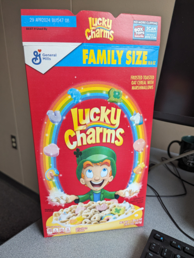
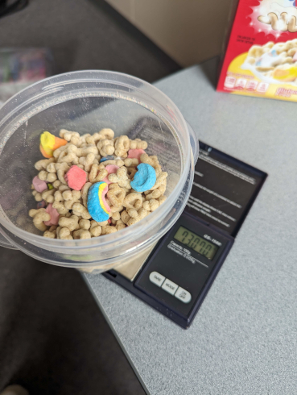
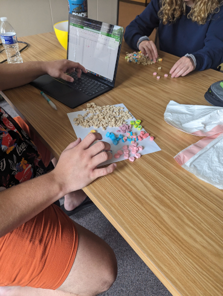
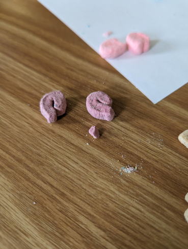
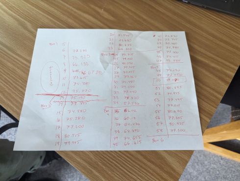
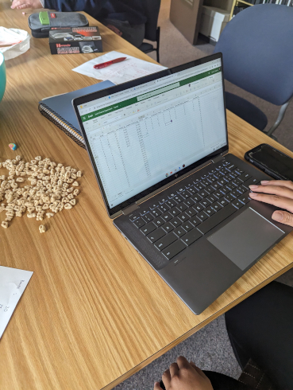
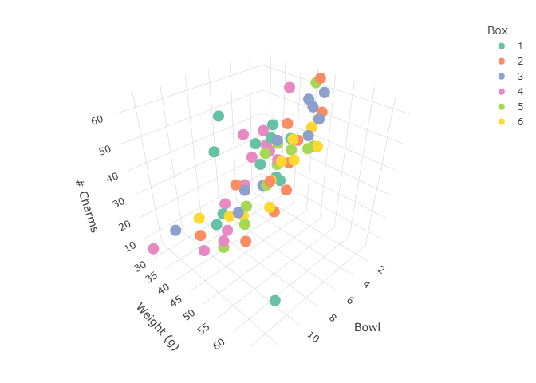
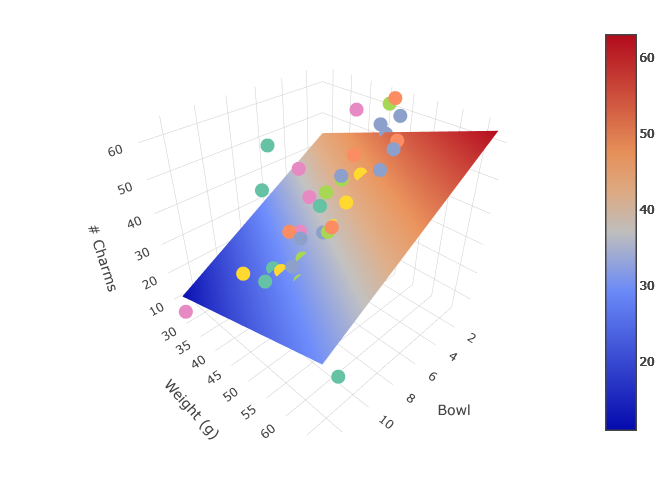

```{r setup, include=FALSE}
knitr::opts_chunk$set(echo = TRUE, message = FALSE, warning = FALSE)
library(ggplot2)
library(plotly)
library(reshape)
library(readxl)
library(tidyverse)
```


**The `tl;dr` version:** A team of students helped design and carry out an experiment to determine whether bowls of Lucky Charms are equally "lucky" over the course of a box of cereal. Turns out, not so much. We estimate a decrease of approximately 2.7 total charms per additional bowl on average. This corresponds to more than a 50% drop-off in charms from the first bowl to the last. The weight of cereal also appears to play a role, and for each 1g of cereal we estimate approximately 0.5 more charms on average with bowl held constant. The interaction between bowl and weight is not statistically significant.

See [this GitHub repository](https://github.com/gjkerns/luckyCharms) for the data, code, photos, *etc*.


# Background and introduction




### Background

In the early 2010's there was a kerfuffle on the Internet over an investigation into whether or not "Double Stuf" Oreos were actually double-stuffed. (They're not.) It was an engaging idea, and a substantial amount of material has been written about it since, [see here for starters](http://blog.recursiveprocess.com/2013/03/03/oreo-original-vs-double-vs-mega/).  The discussion caused enough splash that some teachers were evidently repeating the experiment as an activity in their classrooms, and local students have reported performing similar experiments at their own schools more than 10 years later.  

### Introduction


One morning in the summer of 2023 I was eating a bowl of Lucky Charms for breakfast. The box was nearly empty and I sighed to myself, "Can't wait until this box is done so I can open up a new one..." Now, if you're anything like me, or millions of other people, then you love Lucky Charms, and you've loved them for as long as you can remember, [being around for 60 years](https://en.wikipedia.org/wiki/Lucky_Charms) and all.  They truly are *Magically Delicious*. But sitting there on that summer morning of discontent with a spoon in my hand it struck me that the bowl of cereal I was eating just didn't quite seem as magical as the earlier bowls had been. It was missing something. (The charms, of course.) Was it my imagination? Could this effect be real? And if so, could it be measured?

I happened to be teaching an undergraduate probability & statistics course at the time and the four students and I were determined to find out.


# Experiment and data

After some discussion, the team decided on the following materials and methods.

### Materials

- Six (6) boxes of Family-size Lucky Charms (18.6oz, 527g)
- Electronic kitchen scale
- Two plastic "bowls", Container A and Container B, measuring 40.125g and 28.375g respectively
- Large bowl for discards, some trash bags, and other assorted ancillaries

The Lucky Charms were purchased from our local retailer—Wal-Mart. There was nothing special about $n = 6$ boxes, it was simply the number of boxes a person could carry with two hands to the 6th floor of Cafaro Hall in a single trip. The kitchen scale was for measuring the weight of cereal, which the team thought might be important, and the scale would also help with data collection because we didn't want to be overly preoccupied with sampling the exact same amount of cereal every time.




### Methods

For the purposes of this experiment, a "bowl" was taken to be approximately 1 serving of cereal as recommended by the box (1 cup or 36g), even though it is ridiculous for anybody but a tiny magic leprechaun to get by on 36g of Lucky Charms for breakfast. The team was not especially picky about maintaining bowl size consistency, anything close to 1 cup was considered good enough. We were accounting for mass of cereal with the kitchen scale anyway and were shooting for a healthy range of observed weights.



Each bowl of cereal was poured directly from the box into the plastic container, weighed, and then emptied onto the table surface for counting. The toasted oats were separated from the marshmallows and discarded. Next the following eight (8) charm types were recognized and their number recorded: Pink Hearts, Rainbows, Purple Horseshoes, Blue Moons, Green Clovers, Unicorns, Tasty Red Balloons, and Orange Stars.





Occasionally there were little marshmallow bits in the bowl; not every charm was 100% intact. To deal with this, the team attempted to classify the bit into the type of charm (Green Clover, Blue Moon, etc.), and if the type could be determined, then that bit was counted as 1 in the respective category. If the bit was nondescript or too small for type identification then it was discarded.


## The data

Data were collected during two separate class meetings. The students worked in pairs to pour and count the charms. I helped with the scale and recording a hard copy of weight values as they were called out for entry into the computer. The team got into a data collection groove and by the end of the experiment all 4 students were pouring and counting charms independently.




The plastic container + cereal were weighed together each round, and the weight of the container (measured at the start of the experiment) was subtracted from the observed total weight. The charms were entered into their respective columns and totaled.




### Measured variables

- `Box`: the box number (1 through 6)
- `Bowl`: the sequential bowl for each box (ranges from 1 to 13)
- `Observation`: the observed order of bowls across boxes (1 to 69)
- `Totweight`: weight of the plastic container + cereal, in grams
- `Weight`: of cereal in grams, after subtracting the weight of the container
- `Hearts`, `Stars`, etc: how many of that charm in that bowl
- `Totcharms`: sum total of the assorted charms


Here is some [R](https://www.r-project.org/) code to read in and show the top of the dataset (first 6 rows). The data and all code are shared in [this GitHub repository](https://github.com/gjkerns/luckyCharms).

```{r}
library(readxl)
Lucky <- read_excel("../data/Lucky.xlsx")
Lucky$Box <- as.factor(Lucky$Box)
knitr::kable(head(Lucky))
```


Equipped with these data we can report things like the mean observed `Weight` was approximately 46.3g, the maximum number of a particular charm in any one bowl was 15 (Pink Hearts tied with Purple Horseshoes), and so forth.  We could spend all day computing statistics on this dataset to our Pink Heart's content, but at the moment we are primarily focused on `Totcharms` and how it relates to `Bowl` and maybe `Weight` to a lesser extent.

Here is a graph of `Totcharms` by `Bowl`, colored by `Box`:


```{r}
Lucky |> ggplot(aes(x = Bowl, y = Totcharms, color = Box)) + 
  geom_point(size = 3) +
  labs(y = '# Charms') -> p1
p1
```

Here we see a clear decreasing trend in `Totcharms` as `Bowl` increases, and the pattern is surprisingly linear.  There may be a slight curvature.  The colors are difficult to pick out, so let's make a line plot and highlight a couple of series:


```{r}
sizes <- c(2, 1, 2, 1, 1, 1)
alphas <- c(1, 0.2, 1, 0.2, 0.2, 0.2)
Lucky |> ggplot(aes(x = Bowl, y = Totcharms)) +
  geom_line(aes(colour = Box, linewidth = Box, alpha = Box)) +
  scale_discrete_manual("linewidth", values = sizes) +
  scale_alpha_manual(values = alphas, guide = "none")
```

There is a general trend downward for all series, but the path to get there varies for individual boxes. Notice how Box 3 starts high and stays high for a few bowls before dropping off smoothly to Bowl 10, crashing promptly afterwards. Look at how Box 1 starts the lowest of the crowd, increases after Bowl 5, peaks at Bowl 8, then nosedives down to Bowl 12. The data would suggest that charms were more concentrated near the top of Box 3, but were more clustered in a pocket near the middle of Box 1. Some boxes bounce around, other boxes drift in more of a straight line downward. Put it all together, though, and the overall trend is decreasing and linear. Note that every box made it at least to `Bow1 = 11`, but only two boxes had 12 bowls, and a single box (Box 4) lasted to `Bow1 = 13`.

Now let's take a look at `Totcharms` versus `Weight`:


```{r}
Lucky |> ggplot(aes(x = Weight, y = Totcharms, color = Box)) + 
  geom_point(size = 3) +
  labs(x = 'Weight (g)', y = '# Charms') -> p2
p2
```

This plot is noisy as we might have guessed. We have a nice range of weights, from a minimum under 30g to a maximum near 70g. Notice there was one bowl that clocked-in extraordinarily heavy. The outlier doesn't have any obvious explanation, but if we dig a little deeper and plot `Weight` versus `Bowl` we may gain some insight:

```{r}
Lucky |> ggplot(aes(x = Bowl, y = Weight, color = Box)) + 
  geom_point(size = 3) + ylim(5, 75) +
  labs(y = 'Weight (g)') -> p3
p3
```

We see that the extra-heavy bowl was the last `Bowl = 12` of `Box = 1`. The origin of that particular data point has unfortunately been lost to the sands of time, but bearing in mind that it was the first box the team had ever finished, near the end it may have been difficult to judge how much cereal was left, and perhaps all the remainder was dumped into that final bowl—I do the same thing at breakfast all the time when I get close to the end of a box of cereal. If that 12th bowl of 70g had been split into (say) two bowls of 40g and 30g, respectively, then there would have been two boxes that made it all the way to 13 bowls instead of just one, and maybe the models below would have fit the data slightly better. Alas! We will never know. Such is the scientific enterprise.

While there isn't much of a linear association between `Totcharms` and `Weight` by themselves, there is a hidden relationship between `Totcharms`, `Bowl`, and `Weight` which can best be explored with a 3D visualization:


```{r, eval = FALSE}
library(plotly)
fig <- plot_ly(Lucky, x = ~Bowl, y = ~Weight, z = ~Totcharms, color = ~Box) |>
  add_markers() |>
  layout(scene = list(xaxis = list(title = 'Bowl'),
                                   yaxis = list(title = 'Weight (g)'),
                                   zaxis = list(title = '# Charms')),
                      legend=list(title=list(text='Box')))
fig
```



Plots in 3D are super-cool, but the above static display doesn't do the data justice. I've set up an [interactive version of the plot](https://gkerns.people.ysu.edu/lucky3D.html) at the following link which should work in most mobile/desktop browsers:

<https://gkerns.people.ysu.edu/lucky3D.html>

Please go *there*, spin the data around, zoom, pan---check it out. If you spin it around just right you will see that the dots scatter loosely about a flat plane in 3D-space. This is exactly the kind of relationship we are looking for in a multiple linear regression model (we'll get to that in a minute).

# Model fitting

Now let's try to quantify the linear relationship between these variables.  We will start with a simple linear regression model relating `Totcharms` to `Bowl`.

## For Bowl

Here is the model:

```{r}
mod1 <- lm(Totcharms ~ Bowl, data = Lucky)
summary(mod1)
```

We see that `Bowl` is strongly linearly associated with `Totcharms`.  The slope on `Bowl` is approximately $-2.7$, in other words, for each additional bowl of Lucky Charms eaten we estimate the average `Totcharms` to decrease by 2.7 charms.  Our coefficient of determination is $R^2 = 0.5442$, that is, approximately 54% of the variance in `Totcharms` is explained by the regression model with `Bowl` as a predictor.   Next we really ought to include a proper residual analysis but we are going to skip it. Suffice it to say that the residual plots are relatively well-behaved. Let's check out a fitted line plot with confidence bands for the regression line (the default):

```{r}
p1 + geom_smooth(method = "lm", aes(group=1), colour="black")
```

That's a nice relationship with a clear decreasing trend.

## For Weight

We will do the same thing for `Weight`, ignoring `Bowl` for the time being.  Here we go:

```{r}
mod2 <- lm(Totcharms ~ Weight, data = Lucky)
summary(mod2)
```

We do not find `Weight` to be a very useful predictor of `Totcharms` on its own, which jives with the scatterplot we saw earlier.  We note for reference that the slope on `Weight` is estimated at $0.3502$, that is, each additional 1g of Lucky Charms corresponds to an average `Totcharms` increase of 0.35 charms.  This sounds reasonable: more cereal, more charms.  The coefficient of determination is pretty bad: $R^2 = 0.0347$, in other words, approximately NONE% of the variance in `Totcharms` is explained by the regression model with `Weight` as a predictor.  That's okay; `Weight` was more of a supplementary device to help control for variability in the cereal amounts. The residual analysis here turns out to be not as bad as it could have been, which is comforting, and we should expect a few problems anyway given the extreme observations on the high/low ends of the weight scale. For the sake of completeness we include another fitted line plot:


```{r}
p2 + geom_smooth(method = "lm", aes(group=1), colour="black")
```

I originally planned to use the `ggpubr` package to put these fitted-line plots together and try to save some space in the discussion, but the plots looked rather cramped and were not very informative.  Anyway, this is what I was going to do:

```{r, message = FALSE, warning = FALSE, eval = FALSE}
library(ggpubr)
ggarrange(p1 + geom_smooth(method = "lm", aes(group=1), colour="black"),
          p2 + geom_smooth(method = "lm", aes(group=1), colour="black"),
          align = 'h', labels=c('A', 'B'), legend = "right",
          common.legend = TRUE)
```


## Multiple regression

Now we get to the fun part: we've explored the relationships `Totcharms ~ Bowl` and `Totcharms ~ Weight` individually, but what happens if we put them together?  Let's find out:


```{r}
mod3 <- lm(Totcharms ~ Bowl + Weight, data = Lucky)
summary(mod3)
```

Check it out!  Now `Bowl` and `Weight` are **both** strongly linearly associated with `Totcharms`.  The slope on `Bowl` is almost identical to what it was before, $-2.7$, but the estimated slope on `Weight` has now increased to nearly 0.5 charms for each additional 1g of cereal.  Our (adjusted) Multiple $R^2$ has jumped to almost 60%---this is remarkable considering the small sample size ($n = 6$), the general noise level of the dataset, and maybe some questionable design choices (every little marshmallow bit counts as 1, *etc.*). In retrospect, it is kind of amazing that the data didn't turn out a lot worse. Real data collected by hand in the wild are seldom so good-natured.


### Adding the regression plane

The code for this visualization is a bit more involved than the other examples and has been omitted for brevity, but you can check it all out [in this GitHub Gist](https://gist.github.com/gjkerns/8636439f9e6afdea1ba9d301b2b38947).  Let's get on with the plot:


```{r, echo = FALSE, message = FALSE, warning = FALSE, eval = FALSE}
library(reshape2)

#Graph Resolution (more important for more complex shapes)
graph_reso <- 1

#Setup Axis
axis_x <- seq(min(Lucky$Bowl), max(Lucky$Bowl), by = graph_reso)
axis_y <- seq(min(Lucky$Weight), max(Lucky$Weight), by = graph_reso)

#Sample points
charms_lm_surface <- expand.grid(Bowl = axis_x, Weight = axis_y, KEEP.OUT.ATTRS = FALSE)
charms_lm_surface$Totcharms <- predict.lm(mod3, newdata = charms_lm_surface)
lucky_lm_surface <- acast(charms_lm_surface, Weight ~ Bowl, value.var = "Totcharms") # y ~ x

# construct the base scatterplot
lucky_plot <- plot_ly(Lucky,
                      x = ~Bowl,
                      y = ~Weight,
                      z = ~Totcharms,
                      text = ~Box, # EDIT: ~ added
                      type = "scatter3d",
                      color = ~Box,
                      mode = "markers")

# set up the scene with axis titles
lucky_plot <- lucky_plot |> layout(scene = list(xaxis = list(title = 'Bowl'),
                                   yaxis = list(title = 'Weight (g)'),
                                   zaxis = list(title = '# Charms')),
                                   legend=list(title=list(text='Box')),
                                   showlegend=FALSE)

# add the surface
lucky_plot <- add_trace(p = lucky_plot,
                        z = lucky_lm_surface,
                        x = axis_x,
                        y = axis_y,
                        type = "surface")

# make the plot
lucky_plot
```

Again: a super-cool plot but the static version doesn't do the data justice. [Check out the interactive version](https://gkerns.people.ysu.edu/lucky3Dplane.html) instead:

<https://gkerns.people.ysu.edu/lucky3Dplane.html>



Interactive 3D-plots are a lot of fun. I hope you enjoy playing with the graph as much as I have. As a final remark, in the `tl;dr` statement we claimed that the interaction between `Bowl` and `Weight` is not significant. The reader can confirm it isn't with the following (output omitted):

```{r, eval = FALSE}
summary(lm(Totcharms ~ Bowl * Weight, data = Lucky))
```


# Discussion and questions

I originally thought that either the whole thing would turn out to be a figment of my imagination or the effect would be too small to detect without LOTS AND LOTS of Lucky Charms. I was wrong on both counts. The effect is real, and it is big enough to detect with a handful of boxes, literally two hands full. 

## The Lucky Charms dropoff

The full model leads us quickly to some startling conclusions. For example, how many charms do we estimate in the first bowl of a box of Lucky Charms? We saw earlier that the average `Weight` in this study was 46.3g. When `Box = 1` the model estimates the average Totcharms to be

```{r}
33.3168 + (-2.7552)*1 + 0.4819*46.3
```


That is, around 53 charms in the first bowl of cereal---Mmm, mouth's watering already. What about the last bowl? Okay, not every box made it to `Bowl 13`, but they all made it to `Bowl = 11`. How many charms?


```{r}
33.3168 + (-2.7552)*11 + 0.4819*46.3
```

**WOW.**  25.3 charms on average.  That corresponds to just over a 52% reduction in charms from the first bowl to the 11th.  No, it was most definitely not my imagination. Forget multiple linear regression models and fancy 3D plots, a hungry toddler could detect this difference wearing a blindfold.

Next question: *Why* is there a drop-off? An analysis on physical grounds might go something like this: Consider a box of Lucky Charms to be a simple mechanical mixture of frosted toasted oats and marshmallows. Many external forces agitate the box over the course of its lifetime, such as jostling during transport, placement on the store shelf, and transit to the home, not to mention activity in and around the cupboard. This inevitably leads to a shifting of contents, with the slightly less dense marshmallows migrating toward the top of the box, and the denser toasty oats settling toward the bottom.

This rationale is logical, anyway.  But it leaves some related questions unanswered:

1. Does the same pattern hold true for the individual charm types? (A quick glance suggests "No".)
2. Is the association truly linear, or would a more complicated model better describe the relationship?
3. What other important factors have we overlooked?
4. Are there strategies a person can use to decelerate the Lucky Charm drop-off?
   - Can we cleverly shake the box (somehow) to better mix the marshmallows?
   - What about storage practices?  Does it help if the box is stored upside-down? 
   - Or flat on its side?
   - and so forth.

These open questions will have to wait for another day.


# Next steps

Since the original experiment in Summer 2023, I've rerun the experiment a couple more times with other groups of students. The first was in November 2023 with middle schoolers on [YSU MegaMath Day](https://megamath.ysu.edu/). I failed to give the MegaMath students very specific instructions and before I knew it all teams had removed the plastic bags of cereal from the box and were scooping from the middle of the bag spread flat on the tabletop. I couldn't blame them; it is easier to scoop cereal from the middle with the bag out in the open. Unfortunately, this approach completely destroys any natural density sort-order that may have have been present, the key underlying element we suspect is at play, which compromises the integrity of the experiment. Plus, I doubt anybody's parents ever let them eat their Lucky Charms that way.

The second was in February 2024 with high school students at [YSU MathFest](https://mathfest.ysu.edu/) workshop. in a sequence of two workshops. This time I was ready for them. I put together and distributed a data collection sheet  ([which you can find here](https://gkerns.people.ysu.edu/LuckyCharmsDataCollectionSheet.docx)) with more detailed guidance.  You can check out the extra datasets on GitHub [in the `extraData` directory](https://github.com/gjkerns/luckyCharms/tree/master/extraData).

Moving forward, more data are needed to better estimate the Lucky Charm drop-off, and it would be interesting to test strategies for distributing the charms more uniformly throughout the box. If successful, the first bowl of the box might not be so magical, but on the other hand, maybe those final bowls won't feel like such a chore waiting to open the next brand new box of Lucky Charms!


# Acknowledgements

This experiment and these results would not have been possible without the infectious enthusiasm and tireless attention to detail of all four STAT 3743 students in Summer 2023: Brenna Brocker, Kate Coppola, Gavin Duwe, and Haziq Rabbani. I thank them for hiking down this statistical path with me. I would also like to thank the Department of Mathematics and Statistics at Youngstown State University for supporting both this research and additional data collection at YSU MegaMath Day and YSU MathFest.

# Disclaimers

In case it isn't already abundantly clear, the author is a Lucky Charms fan, so too are the 4 students. The outcomes reported here were not and are not meant as a critique of General Mills, Inc., its subsidiaries, their factory production standards, nor the fine humans and robots gainfully employed there. We are all bound by the same Laws of Physics, and that includes boxes of breakfast cereal.

And full disclosure: I've taken a peek at the extra data collected in the reruns of the experiment. From what I can tell the effect is still present, but it isn't as dramatic. I don't know if this is because the effect is truly smaller than what we originally estimated, or if it is somehow related to the data collection protocol in the middle/high school setting. Only time — and more data — will tell.

# References and code examples

In putting together this article I tried to keep a record of the places I went to find code to build the plots that I wanted and below is a mostly complete list, but maybe I missed some links. If you notice something I missed, then please alert me in the comments and I will fix it.

- <https://stackoverflow.com/questions/74750478/correct-syntax-for-manually-scaling-the-width-of-lines-in-ggplot>
- <https://www.statology.org/ggplot-default-colors/>
- <https://stackoverflow.com/questions/37348719/ggplot2-single-regression-line-when-colour-is-coded-for-by-a-variable>
- <http://blog.recursiveprocess.com/2013/03/03/oreo-original-vs-double-vs-mega/>
- <https://stackoverflow.com/questions/38331198/add-regression-plane-to-3d-scatter-plot-in-plotly>
- <https://stackoverflow.com/questions/38593153/plotly-regression-line-r>
- <https://stackoverflow.com/questions/15633714/adding-a-regression-line-on-a-ggplot>