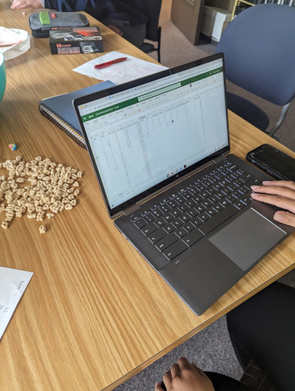

```{r setup, include=FALSE}
knitr::opts_chunk$set(echo = TRUE, message = FALSE)
library(ggplot2)
library(plotly)
library(reshape)
library(readxl)
Lucky <- read_excel("Lucky.xlsx")
Lucky$box <- factor(Lucky$box)
```


The `tl;dr` version: in a given box of Lucky Charms, we estimate a decrease of approximately 2.7 total charms per bowl on average.  The weight of cereal also appears to be significant and for an increase of 1g of cereal we estimate an increase of approximately 0.5 charms on average---for bowl held constant.  The interaction between bowl and weight is not statistically significant.

See this GitHub repository for all of the data, code, photos, etc.

# Background and introduction


### Background

Some years ago I hears a story about somebody investigating the question of whether or not "Double Stuf" Oreos are actually double stuff.  (They're not.)  It was a neat experiment, and there is quite a bit of material on the Internet about it nowadays, [check here to get started](http://blog.recursiveprocess.com/2013/03/03/oreo-original-vs-double-vs-mega/).  Evidently it caused enough splash that some teachers were using it as an introductory statistics activity in the public schools, and indeed students have told me they did it at their own school.  

### Introduction

Against this backdrop and in the summer of 2023, I was eating a bowl of Lucky Charms one morning.  The box was near empty, and I thought to myself, "Gee, I think I'd rather throw the rest of this box out and open up a brand new box!" Now, if you're like me, then you love Lucky Charms, and you've loved them for as long as you can remember.  They truly live up to their catchphrase: *Magically Delicious*!  However, it was on that warm summer morning with a spoon in my hand it dawned on me: the latter bowls of the box don't seem to be quite so *magical* as the earlier bowls are.  They've lost something.  (The charms, of course.)  But is it my imagination?  Is this effect real?  And if so, is it detectable?

I happened to be assigned to teach an upper-division Probability & Statistics class for summer school at the time and the 4 students and I were determined to find out. This is what we found.


# Experiment and data

After some discussion, we decided on our materials and methods.

### Materials

- Six (6) boxes of Family-size Lucky Charms (18.6oz)
- Electronic kitchen scale
- Two plastic "bowls" approximately 8oz

The Lucky Charms were purchased from our local retailer---Wal-Mart.  There wasn't anything special about the number of boxes, it was just how many I could carry with two hands in one trip to the sixth floor of Cafaro Hall.  The scale was for measuring weight of cereal, which the team thought might be important, and it would also help with data collection because we didn't want to be too particular about sampling the exact same quantity of cereal each time.


### Methods

For the purposes of this experiment, a "bowl" was taken to be approximately 1 serving as recommended on the box (8 oz), even though nobody but a tiny magical leprechaun can get by with only 8oz of Lucky Charms for breakfast.  The team was not overly careful with the bowl size, and anything close to 8oz was considered good enough.  We were accounting for mass of cereal with the kitchen scale anyway, and were comfortable with a reasonable range of observed weights.


A bowl was scooped directly out of the box, weighed, and then poured out on a table surface to be counted.  The toasted oats were separated from the marshmallows and discarded.  Then the following charms were recognized and their number recorded:  Rainbows, Pink Hearts, Purple Horseshoes, Blue Moons, Green Clovers, Unicorns, Tasty Red Balloons and Orange Stars.


There were usually little bits and pieces of charms mixed about in the bowl; not every charm is 100% whole.  To deal with this, the team attempted to classify the bit in the type of charm (Green Clover, Blue Moon, etc.), and if the type could be determined, then that bit was counted as 1 in the respective category.  If the bit was too small/nondescript that its type could not be determined then it was discarded.


## The data

Data were collected over two separate class meetings---there was other material to cover, after all.  Two pairs of students collected and counted at once, and I helped with the scale and recording a hard copy of the weight values as they were called out and entered into the computer.


The plastic bowls + cereal were weighed together each round, and then the weight of the bowl (measured at the start of the experiment) was subtracted from the observed value.  The charms were entered into their respective columns and totaled.




### Observed variables

- `box`: the box number (1 through 6)
- `bowl`: the sequential bowl for each box (ranges from 1 to around 12)
- `observation`: the observed order of bowls across boxes (1 to 69)
- `totweight`: weight of each bowl + cereal
- `weight`: of cereal, after subtracting the weight of the respective bowl
- `hearts`, `stars`, etc: how many of that charm in that bowl
- `totcharms`: sum total of the assorted charms


Here is a look at the top of the data set (first 6 rows):


```{r}
head(Lucky)
```


The average `weight` was approximately 46.3g, the naximum number of a particular charm was 15 (Pink Hearts and Purple Horseshoes) in any one bowl, and there are many, many other statistics and tables we can construct for this data set.  For the task at hand, though, at the moment we are primarily concerned with `totcharms`, and how that response variable is related to `bowl`, and maybe `weight` to a lesser extent.

Here is a graph of `totcharms` by `bowl`, colored by `box`.


```{r}
# this is predicted line comparing only chosen variables
Lucky |> ggplot(aes(x = bowl, y = totcharms, color = box)) + 
  geom_point(size = 3) +
  labs(x = 'Bowl', y = '# Charms', color = 'Box') -> p1
p1
```

Here we see a clear decreasing trend in `totcharms` as `bowl` increases, and the pattern is surprisingly linear.  There may be a slight curvature.  The colors are tricky to see (maybe line plots would be better here) but a key takeaway is the relative large variability within a given box.  Some boxes (box 5) bounce around a great deal, while some boxes (box 6) are generally a straight line downward.  Put all together, though, and the general trend is downward, and linear.  Note that all boxes lasted to 11 bowls, but only 2 boxes had 12 bowls and only a single box (box 4) made it to bowl 13.

Now let's look at `totcharms` versus `weight`.


```{r}
# this is predicted line comparing only chosen variables
Lucky |> ggplot(aes(x = weight, y = totcharms, color = box)) + 
  geom_point(size = 3) +
  labs(x = 'Weight (g)', y = '# Charms', color = 'Box') -> p2
p2
```

This is a much noisier plot---as expected.  We have a nice range of weights, from a minimum less than 30 up to a maximum over 65.  Note that the lowest weights are usually associated with the last bowl of the box:  there isn't enough remaining to make the full 8oz.  But notice there is one extra-heavy bowl.  There is nothing to say about that bowl other than it was just a heavy bowl.  The observation is not a mistake, and the scale was not malfunctioning.  It was just a heavy bowl of cereal. The relationship between `totcharms` and `weight` does not appear to be strongly linear, but there is a hidden dependence between `totcharms`, `bowl`, and `weight`, which we can investigate with a 3D plot. 


```{r}
library(plotly)
Lucky$box <- as.factor(Lucky$box)
fig <- plot_ly(Lucky, x = ~bowl, y = ~weight, z = ~totcharms, color = ~box)
fig <- fig %>% add_markers()
fig <- fig %>% layout(scene = list(xaxis = list(title = 'Bowl'),
                                   yaxis = list(title = 'Weight (g)'),
                                   zaxis = list(title = '# Charms')),
                      legend=list(title=list(text='Box')))
fig
```


Note that the 3D plot is interactive.  Go ahead, spin it around, zoom, pan, check it out.  If you spin it around just right you will see that the dots lie more-or-less on a flat plane in 3D space.  This is **exactly** what we are looking for in a multiple linear regression model (we'll go down that path in a minute.)


# Model fitting

Now let's try to fit some regression models to these data.

## For bowl

```{r}
mod1 <- lm(totcharms ~ bowl, data = Lucky)
summary(mod1)
```

Highly significant.


```{r}
p1 + geom_smooth(method = "lm", aes(group=1), colour="black")
```

## For weight


```{r}
p2 + geom_smooth(method = "lm", aes(group=1), colour="black")
```


```{r}
#library(cowplot)
#plot_grid(p1, p2, labels = "AUTO")
```


## Multiple regression


```{r}
mod2 <- lm(totcharms ~ bowl + weight, data = Lucky)
summary(mod2)
```


### Add the regression plane

```{r}
library(plotly)
library(reshape2)
```


The following sets up the extent of our surface. I chose to sample every 0.05 points, and use the extent of the data set as my limits. Can easily be modified here.

```{r}
#Graph Resolution (more important for more complex shapes)
graph_reso <- 0.05

#Setup Axis
axis_x <- seq(min(Lucky$bowl), max(Lucky$bowl), by = graph_reso)
axis_y <- seq(min(Lucky$weight), max(Lucky$weight), by = graph_reso)

#Sample points
charms_lm_surface <- expand.grid(bowl = axis_x, weight = axis_y, KEEP.OUT.ATTRS = FALSE)
charms_lm_surface$totcharms <- predict.lm(mod2, newdata = charms_lm_surface)
lucky_lm_surface <- acast(charms_lm_surface, weight ~ bowl, value.var = "totcharms") #y ~ x
```

At this point, we have `lucky_lm_surface`, which has the z value for every x and y we want to graph. Now we just need to create the base graph (the points), adding color and text for each species:


```{r, warning=FALSE}
# lucky_plot <- plot_ly(Lucky,
#                       x = ~bowl, 
#                       y = ~weight, 
#                       z = ~totcharms,
#                       text = ~box, # EDIT: ~ added
#                       type = "scatter3d", 
#                       color = ~box,
#                       mode = "markers")
# lucky_plot <- lucky_plot |> layout(scene = list(xaxis = list(title = 'Bowl'),
#                                    yaxis = list(title = 'Weight (g)'),
#                                    zaxis = list(title = '# Charms')),
#                                    legend=list(title=list(text='Box')),
#                                    showlegend=FALSE)
# 
# # add the surface
# lucky_plot <- add_trace(p = lucky_plot,
#                         z = lucky_lm_surface,
#                         x = axis_x,
#                         y = axis_y,
#                         type = "surface")
# 
# lucky_plot
```


# Discussion and questions

I originally thought that either the whole thing would turn out to be just my imagination, or that the effect would be too small to detect without LOTS AND LOTS of boxes of Lucky Charms.  Both turned out to be false.  The effect is real, and it is big enough to detect with a handful of boxes.

It is natural to think of a box of Lucky Charms as a simple mixture of cereal and marshmallows, and over time, due to many factors such as jostling during transport, placement on store shelves, transit to the home, and activity on the shelf, there would be a certain amount of settling in the contents of the box, with the less-dense marshmallows tending toward the top, and the slightly more-dense toasted oats tending toward the bottom.  This is logical, anyway.  But then that leads to other questions:

- Does the same pattern hold true for the individual charms?
- Are there strategies one can use to minimize or accelerate the charm dropoff?
  - Can we cleverly shake the box (somehow) to better mix the marshmallows?
  - What about storage practices?  Does it help if the box is stored upside-down? 
  - Or flat on its side?
  - and so forth.
  

# Next steps

Since the original experiment in Summer 2023, I've run the experiment a couple more times with different groups of students.  The first was in November 2023 with middle schoolers as part of YSU MegaMath, and the second was in February 2024 with high schoolers as part of YSU MathFest.  I didn't give the MegaMath students very clear instructions and without warning the first thing every group did was remove the plastic bags of cereal from the boxes and start scooping from the middle of the bag, which is an easier method of scooping cereal, certainly, but it destroys the natural density-sorting of the marshmallows.  By the time MathFest came along I was better organized and wrote a data collection sheet (which you can find here) with more detailed guidance and instructions.  Those data are stored in Github in the `extraData` directory.

Moving forward, I would like to collect more data and get ever-better estimates of the Lucky Charm dropoff, and search for procedures that effectively mix the cereal to better distribute the marshmallows throughout the duration of the Lucky Charms box's lifetime.  As a result maybe the first bowl of the box won't be quite so magical, but on the other hand, maybe those final bowls won't inevitably feel like such a chore, in anticipation of the next brand new box of Lucky Charms!


# Acknowledgements

Gavin Duwe, Kate Coppola, 
Brenna	Brocker
Kate	Coppola
Gavin	Duwe
Haziq	Rabbani


# References


<https://stackoverflow.com/questions/37348719/ggplot2-single-regression-line-when-colour-is-coded-for-by-a-variable>
<http://blog.recursiveprocess.com/2013/03/03/oreo-original-vs-double-vs-mega/>

<https://stackoverflow.com/questions/38331198/add-regression-plane-to-3d-scatter-plot-in-plotly>

<https://stackoverflow.com/questions/38593153/plotly-regression-line-r>

<https://stackoverflow.com/questions/15633714/adding-a-regression-line-on-a-ggplot>