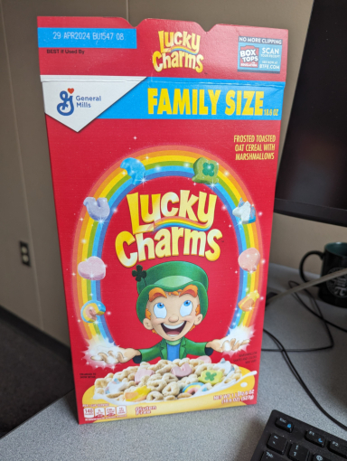
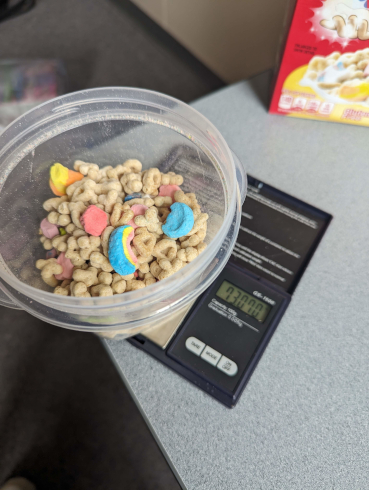
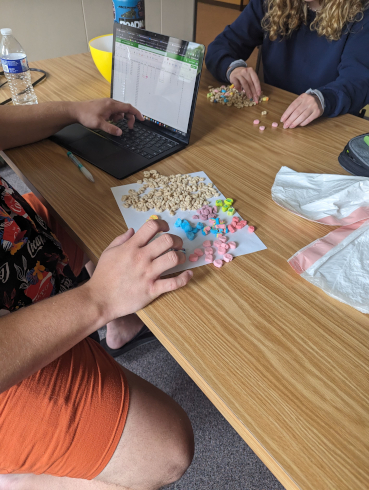
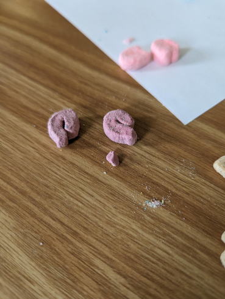
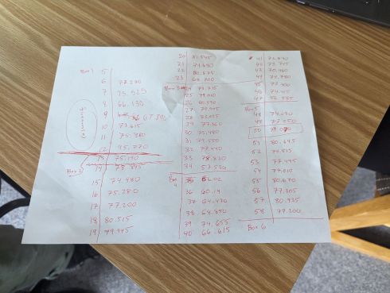
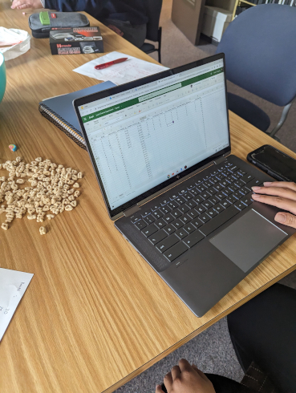
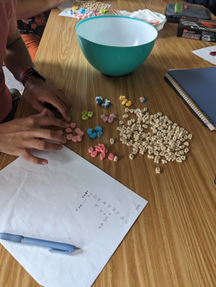

```{r setup, include=FALSE}
knitr::opts_chunk$set(echo = TRUE, message = FALSE, warning = FALSE)
library(ggplot2)
library(plotly)
library(reshape)
library(readxl)
library(tidyverse)
Lucky <- read_excel("Lucky.xlsx")
Lucky$Box <- factor(Lucky$Box)
```


**The `tl;dr` version:** in a given box of Lucky Charms, for each bowl of cereal eaten we estimate a decrease of approximately 2.7 total charms per bowl on average.  The weight of cereal also appears to play a role when suitably incorporated and for each increase of 1g of cereal we estimate approximately 0.5 more charms on average---with bowl held constant.  The interaction between bowl and weight is not statistically significant.

See [this GitHub repository](https://github.com/gjkerns/luckyCharms) for all of the data, code, photos, etc.


# Background and introduction




### Background

In the early 2010's there were a series of articles that circulated on the Internet about somebody investigating whether or not "Double Stuf" Oreos were truly double-stuffed.  (They're not.)  It was a neat idea, and a substantial amount of material has been written about it in the years since, [see here to get started](http://blog.recursiveprocess.com/2013/03/03/oreo-original-vs-double-vs-mega/).  It evidently caused enough splash that some teachers were said to be using the experiment as an activity in their classrooms, and  students locally have reported performing the experiment at their own school.  

### Introduction

Against this backdrop, in the summer of 2023 I was eating a bowl of Lucky Charms for breakfast one morning.  The box was nearly empty, and I thought to myself, "I'd almost rather throw the rest of this box away and open up a brand new box of Lucky Charms!" Now, if you're anything like me, or millions of other people, then you love Lucky Charms, and you've loved them for as long as you can remember. They truly are *Magically Delicious*!  But sitting there that summer morning with a spoon in my hand it occurred to me that my latter bowls of the box just didn't seem quite as *magical* as the first bowls had seemed to be.  They had lost something.  (The charms, of course.)  But could it be my imagination?  Was this effect real?  And if so, was it detectable?

I happened to be teaching an upper-division undergraduate Probability & Statistics class at the time and the 4 students and I were determined to find out.


# Experiment and data

After some discussion, we decided on our materials and methods.

### Materials

- Six (6) boxes of Family-size Lucky Charms (18.6oz, 527g)
- Electronic kitchen scale
- Two plastic "bowls", Container A and Container B, measuring 40.125g and 28.375g respectively
- Large bowl for discards, some trash bags, and other assorted ancillaries

The Lucky Charms were purchased from our local retailer---Wal-Mart.  There was nothing special about $n = 6$ boxes, it was simply the number of boxes a person could carry with two hands to the sixth floor of Cafaro Hall in a single trip.  The kitchen scale was for measuring the weight of cereal, which the team thought might be important, and the scale would also help with data collection because we didn't want to be overly preoccupied with sampling the exact same quantity of cereal every time.




### Methods

For the purposes of this experiment, a "bowl" was taken to be approximately 1 serving as recommended on the box (1 cup or 36g), even though it is ridiculous for anybody but a tiny magical leprechaun to get by on a meager 36g of Lucky Charms for breakfast.  The team was not particularly careful with the bowl size, and anything close to 1 cup was considered good enough.  We were accounting for mass of cereal with the kitchen scale anyway, and were shooting for a healthy range of observed weights.



A bowl was scooped directly out of the box, weighed, and then poured out on a table surface for counting.  The toasted oats were separated from the marshmallows and discarded.  Then the following eight (8) charm types were recognized and their number recorded:  Rainbows, Pink Hearts, Purple Horseshoes, Blue Moons, Green Clovers, Unicorns, Tasty Red Balloons and Orange Stars.





There were typically little bits and pieces of charms mixed about in the bowl; not every charm is 100% whole.  To deal with this, the team attempted to classify the bit as to the type of charm (Green Clover, Blue Moon, etc.), and if the type could be determined, then that bit was counted as 1 in the respective category.  If the bit was too small/nondescript for type  identification then it was discarded.


## The data

Data were collected over two separate class meetings---we had other statistical ground to cover, after all.  Two pairs of students collected and counted at once, and I helped with the scale and recording a hard copy of the weight values as they were called out and entered into the computer.




The plastic container + cereal were weighed together each round, and then the weight of the container (measured at the start of the experiment) was subtracted from the observed total weight.  The charms were entered into their respective columns and totaled.




### Measured variables

- `Box`: the box number (1 through 6)
- `Bowl`: the sequential bowl for each box (ranges from 1 to around 12)
- `Observation`: the observed order of bowls across boxes (1 to 69)
- `Totweight`: weight of each plastic container + cereal, in grams
- `Weight`: of cereal in grams, after subtracting the weight of the container
- `Hearts`, `Stars`, etc: how many of that charm in that bowl
- `Totcharms`: sum total of the assorted charms





Here is a look at the top of the data set (first 6 rows):


```{r}
knitr::kable(head(Lucky), "simple")
```


The average `Weight` was approximately 46.3g, the maximum number of a particular charm in any one bowl was 15 (Pink Hearts was tied with Purple Horseshoes), and we could spend all day computing additional statistics of all shapes and sizes on this dataset until our Pink Heart was content.  At the moment, though, we are primarily interested in `Totcharms` and how that response variable is related to `Bowl` and maybe `Weight` to a lesser extent.

Here is a graph of `Totcharms` by `Bowl`, colored by `Box`.


```{r}
Lucky |> ggplot(aes(x = Bowl, y = Totcharms, color = Box)) + 
  geom_point(size = 3) +
  labs(y = '# Charms') -> p1
p1
```

Here we see a clear decreasing trend in `Totcharms` as `Bowl` increases, and the pattern is surprisingly linear.  There may be a slight curvature.  The colors are difficult to pick out, so let's make a line plot and highlight a couple of series.


```{r}
sizes <- c(2, 1, 2, 1, 1, 1)
alphas <- c(1, 0.2, 1, 0.2, 0.2, 0.2)
Lucky |> ggplot(aes(x = Bowl, y = Totcharms)) +
  geom_line(aes(colour = Box, linewidth = Box, alpha = Box)) +
  scale_discrete_manual("linewidth", values = sizes) +
  scale_alpha_manual(values = alphas, guide = "none")
```

We can see a general trend downward for each series, but the path to get there varies for every box.  Notice how Box 3 starts high and stays high for a few bowls before dropping off smoothly until after Bowl 10 when it crashes. Look how Box 1 starts relatively low, but then increases after Bowl 5, peaks at Bowl 8, then nosedives down to Bowl 12.  It's as if the charms were settled near the top of Box 3, but were more concentrated in a pocket near the middle of Box 1. Some boxes bounce around a great deal, while other boxes are more of a straight line downward.  Put it all together, though, and the overall trend is decreasing and linear.  Note that all boxes lasted to Bowl 11, but only 2 boxes had 12 bowls, and a single box (Box 4) made it to Bowl 13.

Now let's take a look at `Totcharms` versus `Weight`.


```{r}
Lucky |> ggplot(aes(x = Weight, y = Totcharms, color = Box)) + 
  geom_point(size = 3) +
  labs(x = 'Weight (g)', y = '# Charms') -> p2
p2
```

This is a much noisier plot---as we might guess.  We have a nice range of weights, from a minimum under 30g up to a maximum near 70g.  Note that the lowest weights are usually associated with the last bowl of the box:  there isn't enough cereal remaining to make a complete 36g bowl.  And notice there is one bowl that was extraordinarily heavy. It isn't obvious what an explanation for that could be, but if we dig a little deeper and plot `Weight` versus `Bowl` we can get a hint:


```{r}
Lucky |> ggplot(aes(x = Bowl, y = Weight, color = Box)) + 
  geom_point(size = 3) + ylim(5, 75) +
  labs(y = 'Weight (g)') -> p3
p3
```

Now we see that the extra-heavy bowl was the last `Bowl = 12` of `Box = 1`.  The explanation behind that particular data point has unfortunately been lost to the Sands of Time, but bearing in mind that it was the first box the team had ever finished, near the end it may have been difficult to judge how much cereal was left, and perhaps the rest was poured into that final bowl---I personally do the same thing all the time at breakfast when I am nearing the end of a box of cereal.  Looking at the points on the graph, if that 12th bowl of almost 70g had been split into (say) two bowls of 40g and 30g, respectively, then there would have been two boxes that lasted to 13 bowls instead of one box, and maybe the models below would have fit the data slightly better.  Alas!  We will never know. Such is the scientific enterprise.

While the relationship between `Totcharms` and `Weight` is poorly linear, there is a hidden relationship  between `Totcharms`, `Bowl`, and `Weight` which can best be displayed with a 3D visualization. 


```{r}
library(plotly)
Lucky$Box <- as.factor(Lucky$Box)
fig <- plot_ly(Lucky, x = ~Bowl, y = ~Weight, z = ~Totcharms, color = ~Box)
fig <- fig %>% add_markers()
fig <- fig %>% layout(scene = list(xaxis = list(title = 'Bowl'),
                                   yaxis = list(title = 'Weight (g)'),
                                   zaxis = list(title = '# Charms')),
                      legend=list(title=list(text='Box')))
fig
```


**Note that the 3D plot is interactive.**  Go ahead, spin it around, zoom, pan---check it out.  If you spin it around just right you will see that the dots lie more-or-less on a flat plane in 3D-space.  This is **exactly** the kind of relationship we are looking for in a multiple linear regression model (we'll get to that in a minute).


# Model fitting

Now let's try to quantify the linear relationship between these variables.  We will start with a simple linear regression model relating `Totcharms` to `Bowl`.

## For Bowl

Here is the model:

```{r}
mod1 <- lm(Totcharms ~ Bowl, data = Lucky)
summary(mod1)
```

We see that `Bowl` is strongly linearly associated with `Totcharms`.  The slope on `Bowl` is approximately $-2.7$, in other words, for each additional bowl of Lucky Charms eaten we estimate the average `Totcharms` to decrease by 2.7 charms.  Our coefficient of determination is $R^2 = 0.5442$, that is, approximately 54% of the variance in `Totcharms` is explained by the regression model with `Bowl` as a predictor.  There should be a whole discussion included here about residual analysis which we are going to skip, but suffice it to say that the residual plots are relatively well-behaved.  Let's check out a fitted line plot with confidence bands for the regression line (the default):

```{r}
p1 + geom_smooth(method = "lm", aes(group=1), colour="black")
```

That's a nice relationship with a clear decreasing trend.

## For Weight

We will do the same thing for `Weight`, ignoring `Bowl` for the time being.  Here we go:

```{r}
mod2 <- lm(Totcharms ~ Weight, data = Lucky)
summary(mod2)
```

We do not find `Weight` to be a very useful predictor of `Totcharms` on its own, which is consistent with the scatterplot we have already seen.  We note for reference that the slope on `Weight` is estimated at $0.3502$, that is, each additional 1g of Lucky Charms corresponds to an average `Totcharms` increase of 0.35 charms.  This sounds reasonable: more cereal, more charms.  The coefficient of determination is pretty bad: $R^2 = 0.0347$, in other words, approximately NONE% of the variance in `Totcharms` is explained by the regression model with `Weight` as a predictor.  That's okay; `Weight` was more of a supplementary measure to help control for variability in the poured cereal amounts.  The residual analysis turns out to be not as bad as it could have been, which is nice, and we expected at least a few problems anyway given the extreme observations on the high and low ends of the weight range. For the sake of completeness we will include another fitted line plot:


```{r}
p2 + geom_smooth(method = "lm", aes(group=1), colour="black")
```

I originally planned to use the `ggpubr` package to put these fitted-line plots together and try to save some space in the discussion, but the plots were rather cramped and not very informative.  Anyway, this is what I would have done:

```{r, message = FALSE, warning = FALSE, eval = FALSE}
library(ggpubr)
ggarrange(p1 + geom_smooth(method = "lm", aes(group=1), colour="black"),
          p2 + geom_smooth(method = "lm", aes(group=1), colour="black"),
          align = 'h', labels=c('A', 'B'), legend = "right",
          common.legend = TRUE)
```


## Multiple regression

Now we get to the fun part: we've explored the relationship between `Totcharms` and `Bowl` and `Totcharms ~ Weight` individually, but what happens if we put them together?  Let's find out:


```{r}
mod3 <- lm(Totcharms ~ Bowl + Weight, data = Lucky)
summary(mod3)
```

Check it out!  Now `Bowl` and `Weight` are **both** strongly linearly associated with `Totcharms`.  The slope on `Bowl` is nearly identical to what it was previously, $-2.7$, but the estimated slope on `Weight` has now increased to nearly 0.5 charms for each additional 1g of cereal.  Our (adjusted) Multiple $R^2$ has jumped to almost 60%---this is remarkable considering the relatively small sample size, the overall noise level in the dataset, and perhaps some questionable design choices (every little marshmallow bit counts as 1, etc.).  In retrospect, it is kind of amazing that the data didn't turn out to be worse.  It is not often that real data collected by hand in the wild are so good-natured.

### Add the regression plane

We've got to do this one.   The code is more involved than the other examples above and has been omitted in the interest of brevity, but never fear, it is fully included [in this GitHub Gist here](https://gist.github.com/gjkerns/8636439f9e6afdea1ba9d301b2b38947).  Let's get on with the plot:


```{r, echo = FALSE, message = FALSE, warning = FALSE}
library(plotly)
library(reshape2)

#Graph Resolution (more important for more complex shapes)
graph_reso <- 0.05

#Setup Axis
axis_x <- seq(min(Lucky$Bowl), max(Lucky$Bowl), by = graph_reso)
axis_y <- seq(min(Lucky$Weight), max(Lucky$Weight), by = graph_reso)

#Sample points
charms_lm_surface <- expand.grid(Bowl = axis_x, Weight = axis_y, KEEP.OUT.ATTRS = FALSE)
charms_lm_surface$Totcharms <- predict.lm(mod3, newdata = charms_lm_surface)
lucky_lm_surface <- acast(charms_lm_surface, Weight ~ Bowl, value.var = "Totcharms") # y ~ x

# construct the base scatterplot
lucky_plot <- plot_ly(Lucky,
                      x = ~Bowl,
                      y = ~Weight,
                      z = ~Totcharms,
                      text = ~Box, # EDIT: ~ added
                      type = "scatter3d",
                      color = ~Box,
                      mode = "markers")

# set up the scene with axis titles
lucky_plot <- lucky_plot |> layout(scene = list(xaxis = list(title = 'Bowl'),
                                   yaxis = list(title = 'Weight (g)'),
                                   zaxis = list(title = '# Charms')),
                                   legend=list(title=list(text='Box')),
                                   showlegend=FALSE)

# add the surface
lucky_plot <- add_trace(p = lucky_plot,
                        z = lucky_lm_surface,
                        x = axis_x,
                        y = axis_y,
                        type = "surface")

# make the plot
lucky_plot
```

Interactive 3D-plots are a lot of fun.  With `plotly` and `RStudio` and `GitHub` so widely available these days,  sharing such things with other people is easier now than ever before.  I hope you enjoy playing with the above as much as I have.

As a final remark, in the `tl;dr` paragraph at the beginning we claimed that the interaction between `Bowl` and `Weight` is not significant.  It isn't.  We leave that for the reader to verify independently via something like the following:

```{r, eval = FALSE}
summary(lm(Totcharms ~ Bowl * Weight, data = Lucky))
```


# Discussion and questions

I originally thought that either the whole thing would turn out to be just my imagination, or that the effect would be too small to detect without LOTS AND LOTS of boxes of Lucky Charms.  Both turned out to be false.  The effect is real, and it is big enough to detect with a handful of boxes.

The standard explanation on physical grounds would probably consider a box of Lucky Charms as a simple mixture of cereal and marshmallows, with the notion that over time, due to many factors affecting the boxes such as jostling during transport, placement on store shelves, transit to the home, and activity on the shelf, we should expect a certain amount of settling in the contents of the box, with the less-dense marshmallows tending toward the top, and the slightly more-dense toasted oats tending toward the bottom.  This is logical, anyway.  But there are several open questions

- Does the same pattern hold true for the individual charms? (Quick glance suggests "No".)
- Is the association truly linear, or is curvature needed to best describe the relationshio?
- Are there strategies a person can use to minimize or accelerate the Lucky Charm dropoff?
  - Can you cleverly shake the box (somehow) to better mix the marshmallows?
  - What about storage practices?  Does it help if the box is stored upside-down? 
  - Or flat on its side?
  - and so forth.


# Next steps

Since the original experiment in Summer 2023, I've run the experiment a couple more times with different groups of students.  The first was in November 2023 with middle schoolers as part of [YSU MegaMath](https://megamath.ysu.edu/), and the second was in February 2024 with high schoolers as part of [YSU MathFest](https://mathfest.ysu.edu/).  I didn't give the MegaMath students very clear instructions and before I knew it all teams had removed the plastic bags of cereal from the boxes and were scooping from the middle of the bag. I don't blame them; it is a much easier method of scooping cereal, certainly, but it mostly destroys the natural density-sorting of the marshmallows, the key underlying factor we expect is at play.  By the time MathFest came along I was better organized and wrote a data collection sheet (which you can find here) with more detailed guidance and instructions.  Those data are stored in Github in the `extraData` directory.

Moving forward, I would like to collect more data and get ever-better estimates of the Lucky Charm dropoff, and search for procedures that effectively mix the cereal to better distribute the marshmallows throughout the duration of the Lucky Charms box's lifetime.  As a result maybe the first bowl of the box won't be quite so magical, but on the other hand, maybe those final bowls won't feel like such a chore, waiting for the next brand new box of Lucky Charms!


# Acknowledgements

This experiment and these results would not have been possible without the enthusiasm and diligent attention to detail of all four STAT 3743 students of Summer 2023: Brenna Brocker, Kate Coppola, Gavin Duwe, and Haziq Rabbani.  I would also like to thank the Department of Mathematics and Statistics at Youngstown State University for supporting this research and supporting additional data collection at YSU MegaMath and YSU MathFest.


# References and code examples

- <https://stackoverflow.com/questions/74750478/correct-syntax-for-manually-scaling-the-width-of-lines-in-ggplot>
- <https://www.statology.org/ggplot-default-colors/>
- <https://stackoverflow.com/questions/37348719/ggplot2-single-regression-line-when-colour-is-coded-for-by-a-variable>
- <http://blog.recursiveprocess.com/2013/03/03/oreo-original-vs-double-vs-mega/>
- <https://stackoverflow.com/questions/38331198/add-regression-plane-to-3d-scatter-plot-in-plotly>
- <https://stackoverflow.com/questions/38593153/plotly-regression-line-r>
- <https://stackoverflow.com/questions/15633714/adding-a-regression-line-on-a-ggplot>